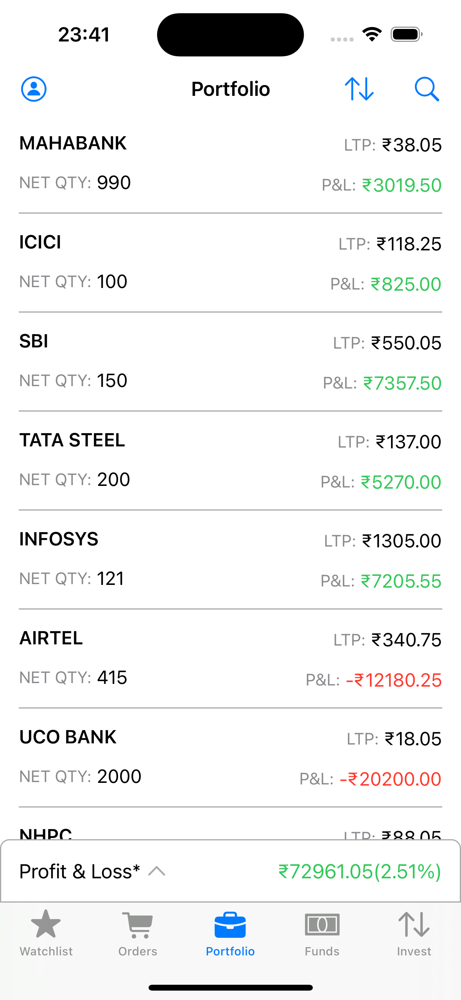
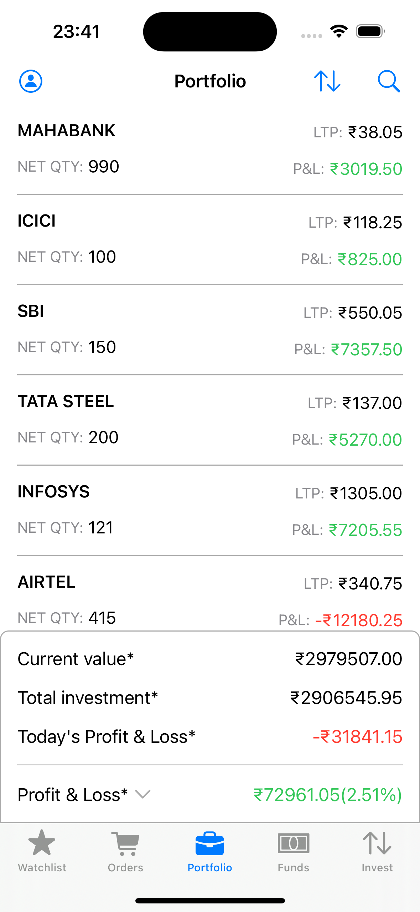

# Trading App

A basic trading app built using Swift and UIKit without using storyboards

(Disclaimer: The images show a dummy portfolio and this is not an investment advice)

### Snapshots

 

### Features
- No use of XIBs/Storyboards

### Tech stack
- MVVM
- Swift
- XCode
- UIKit (programmatically)
